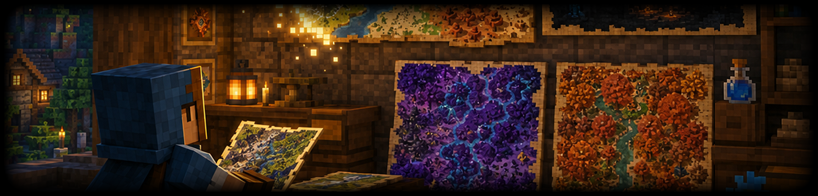
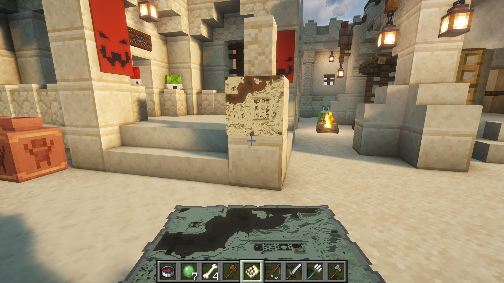
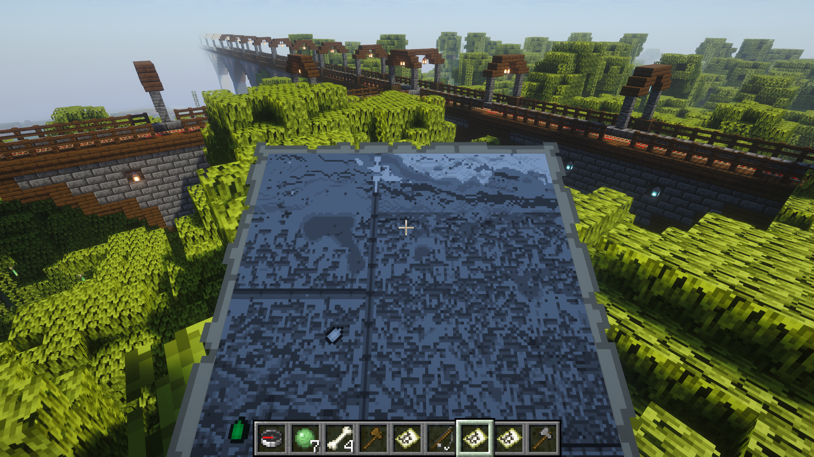
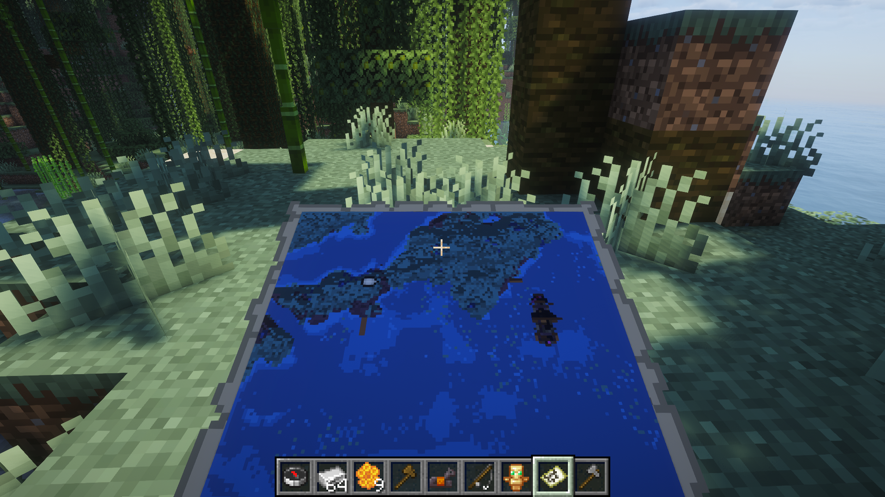
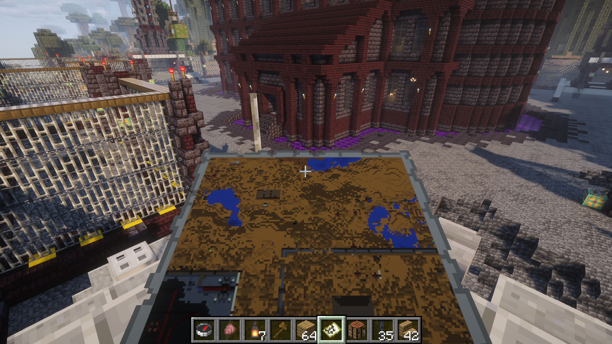
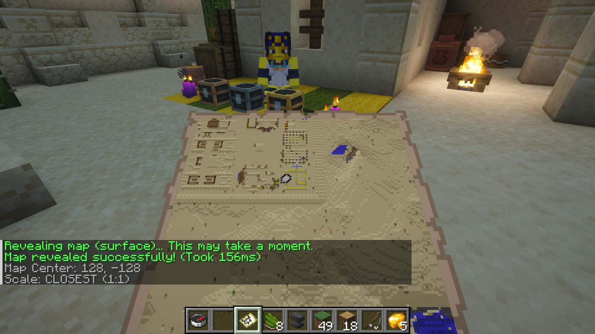
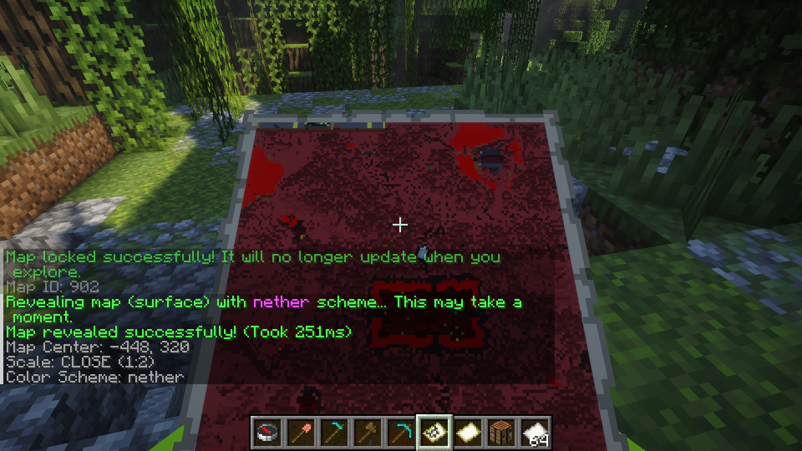

<p align="center">
  
</p>
<h1 align="center">Cobbleworks - Map Revealer Plugin</h1>
<p align="center">
  <b>Fill held maps from terrain or keep complete item-frame map walls synchronized automatically.</b><br>
  <b>Render safely from chunk snapshots, update only changed pixels, and control markers, labels, locking, and refresh timing.</b>
</p>
<p align="center">
  <a href="https://github.com/Cobbleworks/Map-Revealer-Plugin/releases"></a>&nbsp;&nbsp;<a href="https://github.com/Cobbleworks/Map-Revealer-Plugin/blob/main/LICENSE"></a>&nbsp;&nbsp;&nbsp;&nbsp;&nbsp;&nbsp;
</p>

Map Revealer renders the terrain covered by a filled map without requiring a player to explore it first. It also manages rectangular map walls made from normal or glow item frames, including existing aligned map grids and empty frames that need maps. Each wall persists across restarts and refreshes from real terrain on its own schedule.

## Core Features

- Renders all 128 × 128 pixels of the map held in the player's main hand
- Supports all five Minecraft map scales (0–4), surface rendering, and fixed Y-level slices
- Renders Overworld terrain, End islands with transparent void, and Nether slices below the bedrock roof
- Includes normal colors and nine themed palettes
- Preserves terrain shading while applying themed colors
- Automatically locks maps rendered with a themed scheme
- Provides a separate command for locking any filled map
- Creates complete map grids in connected empty item frames and glow item frames
- Adopts correctly aligned maps already sitting in frames without replacing their map IDs
- Refreshes managed walls automatically and writes only map pixels whose colors changed
- Supports per-wall intervals, locked or unlocked maps, player markers, region labels, and optional expansion
- Captures chunks safely, processes immutable terrain snapshots asynchronously, and applies map changes on the server thread
- Refuses irregular layouts, non-map frame contents, mismatched existing maps, and ownership conflicts

## Supported Platforms

- Minecraft 1.20 or newer
- Paper or a compatible Paper fork
- Java 17 or newer

## Table of Contents

1. [Core Features](#core-features)
2. [Supported Platforms](#supported-platforms)
3. [Installation](#installation)
4. [Third-Party Plugins](#third-party-plugins)
5. [Configuration](#configuration)
6. [Using Map Revealer](#using-map-revealer)
7. [Managed Map Walls](#managed-map-walls)
    - [Creating a Wall](#creating-a-wall)
    - [Existing Maps and Safety](#existing-maps-and-safety)
    - [Refreshes and Changed Regions](#refreshes-and-changed-regions)
    - [Markers, Labels, Locking, and Expansion](#markers-labels-locking-and-expansion)
8. [Color Schemes](#color-schemes)
9. [Commands](#commands)
10. [Permissions](#permissions)
11. [Operational Notes](#operational-notes)
12. [Building From Source](#building-from-source)
13. [License](#license)
14. [Screenshots](#screenshots)

## Installation

1. Download the latest jar from [Releases](https://github.com/Cobbleworks/Map-Revealer-Plugin/releases).
2. Stop the server and copy the jar into `plugins/`.
3. Start the server.
4. Give trusted players `maprevealer.reveal`, or use the command as an operator.
5. Hold a filled map in the main hand and run `/revealmap`.

The first start creates `plugins/MapRevealer/config.yml`. Managed walls are stored separately in `walls.yml`; edit neither file while the server is running.

For a first test, use a normal map at scale 0 in a familiar area. Once the result looks correct, try a themed scheme or a fixed depth. Copy valuable map items before experimenting: rendering replaces the pixel data on the held map rather than creating a separate item.

## Third-Party Plugins

None. Map Revealer is self-contained and does not hook into a permissions plugin directly. Any Paper-compatible permission manager can grant its permission nodes.

## Configuration

| Setting | Default | Description |
|---------|---------|-------------|
| `rendering.generate-missing-chunks` | `false` | Allow a reveal to generate terrain that does not exist yet |
| `rendering.max-chunks-per-map` | `16384` | Refuse a single map render above this terrain-chunk count |
| `rendering.capture-chunks-per-tick` | `16` | Maximum chunk captures requested per batch |
| `rendering.nether-depth` | `64` | Default downward slice in Nether worlds; avoids the roof |
| `rendering.max-pending-maps` | `256` | Maximum queued wall or held-map renders |
| `map-walls.max-frames` | `256` | Maximum maps managed by one wall |
| `map-walls.max-scale` | `4` | Largest scale accepted when creating or adopting a wall |
| `map-walls.discovery-span` | `24` | Maximum frame discovery distance from the selected frame |
| `map-walls.minimum-refresh-minutes` | `5` | Lowest per-wall interval accepted by commands |
| `map-walls.defaults.refresh-minutes` | `30` | Initial automatic refresh interval |
| `map-walls.defaults.locked` | `true` | Lock newly generated wall maps by default |
| `map-walls.defaults.player-markers` | `false` | Show online players on new walls |
| `map-walls.defaults.auto-expand` | `false` | Automatically claim a newly placed adjacent empty frame |

When upgrading an older configuration without `config-version`, the previous shipped limits (`max-scale: 1` and `max-chunks-per-map: 4096`) are upgraded automatically. Other customized limits are preserved. Nether depth and capture limits use the defaults above when absent.

## Map Scales and Dimensions

[Minecraft Wiki](https://minecraft.wiki/w/Tutorial:Mapping) documents five scales:

| Scale | Blocks per pixel | Terrain covered by each map |
|-------|------------------|-----------------------------|
| `0` | 1 | 128 × 128 |
| `1` | 2 | 256 × 256 |
| `2` | 4 | 512 × 512 |
| `3` | 8 | 1024 × 1024 |
| `4` | 16 | 2048 × 2048 |

All scales work for held maps and walls. Larger scales take longer to load, particularly when generating new terrain. Chunk capture runs in bounded strips rather than keeping an entire scale-4 map's snapshots in memory.

In the End, islands render normally and void remains transparent. In the Nether, automatic rendering samples downward from `rendering.nether-depth` (Y=64 by default), exposing lava, terrain, and structures below the roof. A depth slice shows one layer of the dimension: choose another Y-level to reveal a different floor. A `nether` color theme changes colors independently of the world's dimension.

## Using Map Revealer

The command samples one world position for every map pixel. The map's own world, center, and scale determine the sampled X/Z coordinates.

- With no depth, each pixel uses the world's surface and skips fully transparent blocks. Nether worlds use the configured below-roof slice instead.
- With a depth, sampling begins at the requested Y-level and moves downward past air or transparent blocks.
- Water and foliage receive specialized color handling; surrounding elevation is used for terrain shading.
- A themed color scheme remaps the calculated Minecraft map color while retaining its shade where appropriate.
- The completed pixel data is written to the existing map item; the command does not create a new map.
- Generated terrain chunks are loaded asynchronously. Ungenerated chunks stay blank unless `generate-missing-chunks` is explicitly enabled.

The player must remain online for the completion message, and the filled map must contain a valid `MapView`.

## Managed Map Walls

### Creating a Wall

Build a complete rectangular grid of item frames or glow item frames on one vertical surface. Look directly at the frame that should represent your current location and run:

```text
/revealmap wall create spawn 0
```

For a 3×3 wall, use the center frame. Empty frames receive newly created maps; the selected frame is centered on the player's current X/Z position and neighboring maps are offset by exactly one map width. The wall definition and frame/map IDs are saved in `walls.yml`, then the first refresh is queued.

### Existing Maps and Safety

A connected wall may already contain filled maps. Map Revealer adopts them only when every existing map uses the same world and scale and its center belongs to the expected seamless grid. Their map IDs are preserved. Empty frames in the same grid receive new maps.

Creation stops before making changes if it encounters an irregular frame shape, another managed wall, an invalid or misaligned map, or an item other than a filled map. Automatic expansion is off by default and only ever claims a newly placed empty frame. Removing a wall definition clears Cobbleworks ownership data but leaves every frame and map item in place.

### Refreshes and Changed Regions

Every wall has its own interval, initially `30` minutes. Refresh jobs are serialized so large walls cannot start all of their maps simultaneously. Paper loads existing terrain chunks asynchronously, immutable chunk snapshots are processed off-thread, and the resulting colors are applied on the server thread. The map writer compares the new buffer with the saved vanilla buffer and marks only changed pixels dirty.

Set a persistent theme with `/revealmap wall set <name> theme sepia` (or `nether`, `ender`, etc.). Use `/revealmap wall set <name> depth 64` for a fixed slice, or `depth auto` for the dimension default. These settings queue a refresh automatically and survive restarts. Themed, depth-sliced, and Nether wall maps stay locked to preserve their pixels.

Use `/revealmap wall refresh <name>` for an immediate administrative refresh. Frames that are unloaded, removed, emptied, or contain a different map are skipped rather than repaired or overwritten.

### Markers, Labels, Locking, and Expansion

- `markers on` adds live player cursors to maps that currently contain those players.
- `label <text>` places a named region marker on the selected origin map; use `label off` to remove it.
- `locked on|off` controls the locked state of every managed map without disabling plugin refreshes.
- `/revealmap wall expand <name>` explicitly claims connected empty frames around a selected managed frame.
- `auto-expand on` lets a wall claim a newly placed adjacent empty frame. It remains opt-in so ordinary decoration is never changed unexpectedly.

## Color Schemes

There are 10 scheme values: the standard palette plus nine themed alternatives.

| Scheme | Appearance |
|--------|------------|
| `normal` | Standard Minecraft map colors |
| `withered` | Faded and desaturated |
| `ender` | Purple void tones |
| `mystic` | Blue and purple magical tones |
| `nether` | Red and orange volcanic tones |
| `sepia` | Warm antique tones |
| `grayscale` | Monochrome shades |
| `inverted` | Reversed color treatment |
| `ocean` | Blue and green nautical tones |
| `autumn` | Orange and brown seasonal tones |

Any scheme other than `normal`, or any depth slice, is locked automatically after rendering. Normal maps remain able to update through ordinary Minecraft exploration unless `/revealmap lock` is used.

## Commands

`/reveal` and `/mapreveal` are aliases for `/revealmap`. Commands are player-only and require a filled map in the main hand where noted.

| Command | Description |
|---------|-------------|
| `/revealmap reveal [depth] [theme]` | Render the held map with explicit command structure. The shorter forms below remain supported. |
| `/revealmap` | Render the held map at surface level with normal colors. |
| `/revealmap <depth>` | Render from a specific Y-level within the current world's height bounds. |
| `/revealmap <scheme>` | Render the surface with one of the listed schemes. |
| `/revealmap <depth> <scheme>` | Combine a Y-level with a color scheme. The two arguments may be supplied in either order. |
| `/revealmap lock` | Lock the held map against normal exploration updates. |
| `/revealmap schemes` | List all schemes in chat. `/revealmap colors` does the same. |
| `/revealmap help` | Show the in-game command summary. |
| `/revealmap wall create <name> [scale]` | Create or safely adopt the connected rectangular frame wall being viewed. |
| `/revealmap wall expand <name>` | Add connected empty frames around the managed frame being viewed. |
| `/revealmap wall refresh <name\|all>` | Force an immediate terrain refresh. |
| `/revealmap wall set <name> theme <theme>` | Apply and save a wall theme, then refresh it. |
| `/revealmap wall set <name> depth <Y\|auto>` | Choose a slice or the dimension default, then refresh it. |
| `/revealmap wall set <name> interval <minutes>` | Change the automatic refresh interval. |
| `/revealmap wall set <name> <locked\|markers\|auto-expand> <on\|off>` | Change a boolean wall option. |
| `/revealmap wall set <name> label <text\|off>` | Add or remove the origin-map region label. |
| `/revealmap wall list` | Show stored wall sizes and settings. |
| `/revealmap wall remove <name>` | Stop managing a wall without deleting its frames or maps. |

Examples:

```text
/revealmap 64
/revealmap sepia
/revealmap -10 grayscale
/revealmap mystic 32
/revealmap wall create atlas 4
/revealmap wall set atlas theme sepia
/revealmap wall set atlas depth auto
```

## Permissions

| Permission | Default | Description |
|------------|---------|-------------|
| `maprevealer.reveal` | Operators | Reveal or lock a filled map held in the main hand. |
| `maprevealer.wall.manage` | Operators | Create, configure, expand, refresh, and remove managed map walls. |

## Operational Notes

- Larger map scales sample positions farther apart but still render 16,384 pixels.
- Revealing terrain may load generated world chunks covered by the map, so test queue and chunk limits under normal server load before creating a very large wall.
- Scale 3 and 4 maps can address thousands of terrain chunks. Managed walls support scales 0–4 by default, and `max-chunks-per-map` provides a hard safety limit.
- The plugin uses Paper's public locking API. Persistent pixel-buffer access remains version-sensitive because Bukkit does not expose a public saved-map pixel writer; verify a test map after a major server implementation update.
- Completion output includes changed pixels, map center, scale, selected depth, scheme, and elapsed time.

## Building From Source

Requirements: Java 17 or newer and Maven 3.6 or newer.

```bash
git clone https://github.com/Cobbleworks/Map-Revealer-Plugin.git
cd Map-Revealer-Plugin
mvn clean package
```

The compiled jar is written to `target/`.

## License

This project is licensed under the [MIT License](LICENSE).

## Screenshots

<table>
  <tr>
    <th>Sepia Theme in an Item Frame</th>
    <th>Grayscale Theme</th>
  </tr>
  <tr>
    <td><a href="images/screenshot-sepia-itemframe.png"></a></td>
    <td><a href="images/screenshot-grayscale-theme.png"></a></td>
  </tr>
  <tr>
    <th>Mystic Theme</th>
    <th>Autumn Theme</th>
  </tr>
  <tr>
    <td><a href="images/screenshot-mystic-theme.png"></a></td>
    <td><a href="images/screenshot-autumn-theme.png"></a></td>
  </tr>
  <tr>
    <th>Desert Reveal</th>
    <th>Nether Theme</th>
  </tr>
  <tr>
    <td><a href="images/screenshot-desert-reveal.png"></a></td>
    <td><a href="images/screenshot-nether-map.png"></a></td>
  </tr>
</table>
